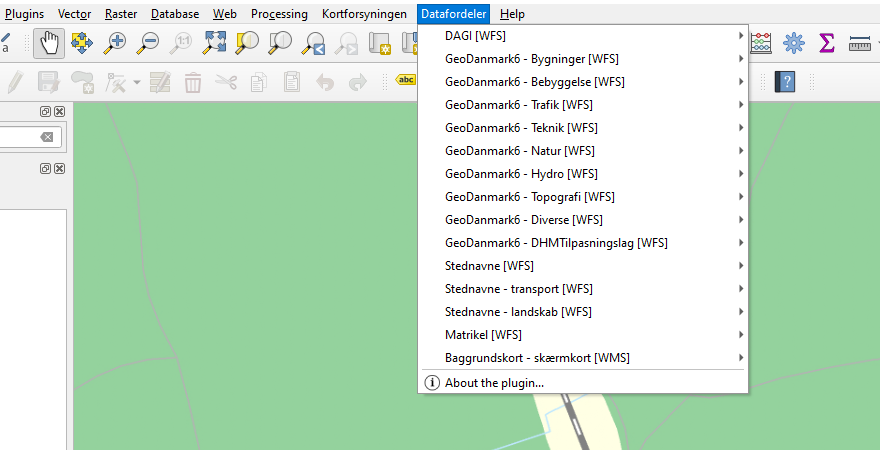

# Datafordeler

# Vigtig info - den service som pluginet bruger nedlægges pr. 15. december 2023, hvorefter pluginet ikke længere vil virke
Tilbage i 2016 var det ikke muligt at tilgå Datafordelerens WFS-data i QGIS. Dette skyldtes, at WFS-tjenesterne blev udstillet med en kompleks struktur som QGIS ikke kunne håndtere. I Septima lavede vi en række ændringer til QGIS' håndtering af WFS'er og desuden udviklede vi en proxy, der omdannede WFS-tjenester fra Datafordeleren til en form som QGIS kunne vise. Disse omdannede WFS-tjenester udstillede vi via QGIS-pluginet 'Datafordeler'. Disse ændringer blev finansieret af en række kommuner, en styrelse og en organisation - og Septima finansierede også en del timer i projektet. Du kan læse mere om baggrunden for udviklingen af pluginet <a href="https://septima.dk/nyheder/DatafordelerPlugin">her</a>.

Septima har siden 2016 haft denne proxy kørende, herunder finaniseret vedligeholdelsen og udstilling af denne proxy. Pluginet har vi stillet frit til rådighed.

Siden 2016 er der blevet lavet en række ændringer til håndteringen af WFS'er i QGIS' kernekode. Desuden har Styrelsen for Dataforsyning og Infrastruktur (SDFI) sidenhen lavet en proxy til Datafordeleren, og SDFI udstiller nu en række WFS'er fra Datafordeleren via QGIS-pluginet 'Dataforsyningen'.

Da en række af Datafordelerens data nu er tilgængelig via pluginet 'Dataforsyningen', synes vi i Septima, at QGIS-pluginet 'Datafordeler' har mistet sin værdi.   
Derfor vil vi ændre Datafordeler-pluginets status til 'forældet'/'deprecated', og den proxy som pluginet bruger vil blive nedlagt d. 15. december 2023.

Vi har oprettet forslag til flere lag på Dataforsyningspluginet - https://github.com/SDFIdk/Qgis-dataforsyningen/issues/30.
Vi vil anbefale, at I skriver på Dataforsyningens Github (fx på <a href="https://github.com/SDFIdk/Qgis-dataforsyningen/issues/30">Issue 30</a>), hvis I har ønsker om at flere datasæt udstilles via Dataforsynings-pluginet.

# Om pluginet

Plugin til QGIS som gør det nemmere at tilføje services fra Datafordeleren. Koden til dette plugin er baseret på koden fra Kortforsyningspluginet.

Bemærk, at Septima stiller pluginet frit og gratis til rådighed i det håb, at det kan være til nytte. Vi kan desværre ikke tilbyde gratis support.

## Installation
Pluginet installeres gennem QGIS´ plugin manager ved at søge på `Datafordeler`.
  
## Første gang du bruger pluginet
Pluginet kræver en tjenestebruger til Datafordeleren. For at kunne oprette en tjenestebruger skal du først oprette en webbruger, derefter kan der oprettes en tjenestebruger under denne webbruger. Læs mere på [Datafordelerens dokumentation](https://datafordeler.dk/vejledning/brugeradgang/brugeroprettelse/).

I QGIS konfigurerer du pluginet med brugernavn og password således:
- Søg efter 'Datafordeler' i Locator-feltet (dvs. søgefelter i nederste venstre hjørne af QGIS), og klik på 'Datafordeler (Muligheder)'/'Datafordeler (Settings)', herved åbnes en dialog
- I denne dialog indtastes **tjenestebrugernavn** og adgangskode til tjenestebrugeren
- Klik 'OK'
